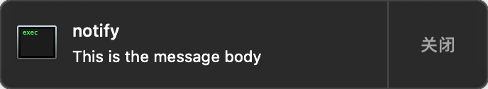
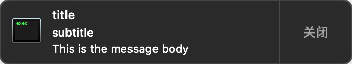
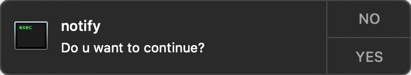
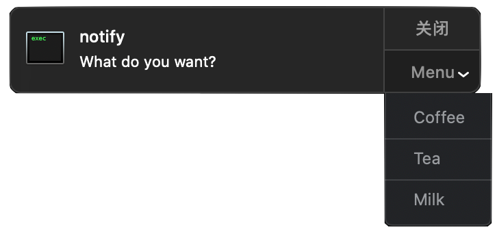

# Notifier

[English](./README.md)


Notifier 是一个发送通知的命令行工具。它提供了不同用户交互的通知的 API

# 功能

1. 发送一条信息体通知

2. 发送一条带标题、子标题、信息体的通知

3. 发送一条带有图标的通知（在横幅的左边）

4. 发送一条带有图片的通知（在横幅的右边）

5. 发送一条带有一个或者多个选择的通知

6. 发送一条可以回复内容的通知

7. 发送一条带有声音的通知

8. 模拟某一个应用发送一条通知

9. 发送一条通知并在特定时间后自动隐藏

# 安装

1. 下载这个仓库
2. 使用 Xcode 编译 `Notify (Release)` scheme 
3. 在终端中键入 `$ notify --help` 获取帮助信息

# 使用

### 基本：基本信息

发送一条信息体通知

```shell
$ notify "This is the message body"
```

得到通知横幅:



----

### 基本：丰富信息

发送一条带标题、子标题、信息体的通知

```shell
$ notify "This is the message body" --title "title" --subtitle "subtitle"
```

得到通知横幅:



---

### 交互：一个选择

发送一条带有选择的通知

```shell
ACTION=$(notify 'Do u want to continue?' --action 'YES' --close 'NO')
```

得到通知横幅:



当用户点击后，命令行将会输出用户点击的按钮的标题，并返回。 比如:

```shell
ACTION=$(notify 'Do u want to continue?' --action 'YES' --close 'NO')
if [[ "${ACTION}" == "YES" ]]; then
    echo 'You click YES'
else
    echo 'You click NO'
fi
```

---

### 交互：多个选择

发送一条多个选择的通知

```shell
ACTION=$(notify 'What do you want?' --action 'Coffee' --action 'Tea' --action 'Milk' --menu 'Menu')

## typin more --action 'TITLE' to insert more button
## typin --menu 'TITLE' to special dropdown button title

if [[ "${ACTION}" == "Cofee" ]]; then
    echo 'You want to a cup of coffee!'
elif [[ "${ACTION}" == "Tea" ]]; then
    echo 'You want to a cup of tea!'
elif [[ "${ACTION}" == "Milk" ]]; then
    echo 'You want to a cup of milk!'
else
    echo "Thanks!"
fi
```

得到通知横幅:



---

### 交互：回复

发送一条带有回复消息输入框的通知

```shell
ACTION=$(notify 'Steve: Go tomorrow?' --reply 'Reply Steve')
if [[ "${ACTION}" == "close" ]]; then
    echo 'You dont say anything to Steve'
else
    echo "You said '${ACTION}'"
fi
```

得到通知横幅:


---

### 媒体: 图标 & 图片

发送一条带有图标或者图片的通知

```shell
$ notify 'Message' --icon './icon.png' --image './image.png'
```

得到通知横幅:


---

### 媒体: 声音

发送一条带有声音的通知

```shell
$ notify 'Message' --sound 'default' # post with a ringing
```

---

### 超时

发送一条会自动隐藏的通知

```shell
ACTION=$(notify 'Some error, repeat?' --action 'YES' --close 'NO' --timeout 5)
if [[ "${ACTION}" == "timeout" ]]; then
    echo 'You did not choose anything'
fi
```

---

### 应用程序

模拟一个应用发送通知

```shell
$ notify 'Download succeed!' --sender 'com.apple.finder'
```

得到通知横幅:


---

# 协议

MIT.
